# Better Unity
A collection of modifications/additions (scripts/prefabs) which enhance [for me] the overall flow of using the Unity Engine.

## Purpose
There are some key features pan other game engines that seem to be lacking in Unity and this is a package to resolve those problems.
<br>

## Installation
You can download the latest ```.unitypackage``` through [Releases](https://github.com/sudotman/BetterUnity/releases/) and double-click to import it.


# Contents

## 1. Better Transform
An extension of the existing Transform component to include some ease-to-use features.


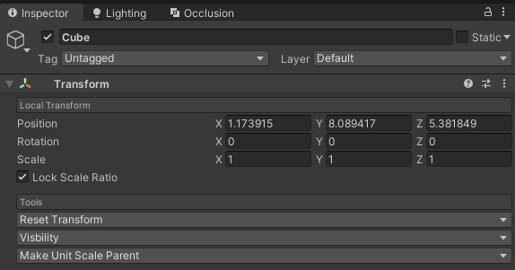

### 1.1 Lock Scale Ratio (Uniform Scale):
Maintain the ratio of the scaling in an object's axes when scaling a GameObject up/down.


### 1.2 Reset Position, Rotation, Scale:
Reset the position, rotation and scale of any GameObject with a click instead of resetting the entire transform or manually inputting `0,0,0 / 1,1,1`.

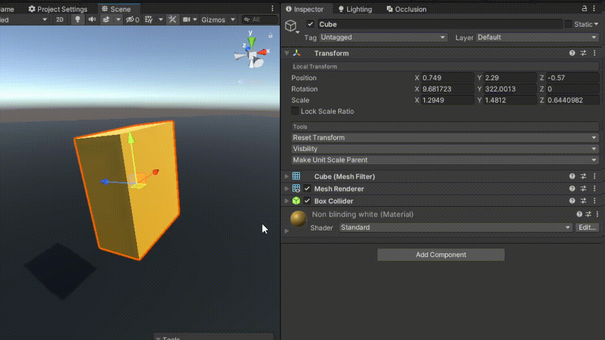

### 1.3 Visibility Toggle:
Sometimes you would want to only disable the Mesh Renderers and not Disable the object so that the scripts/components on them still execute. This disables all the Mesh Renderers in this GameObject and all the children renderers.

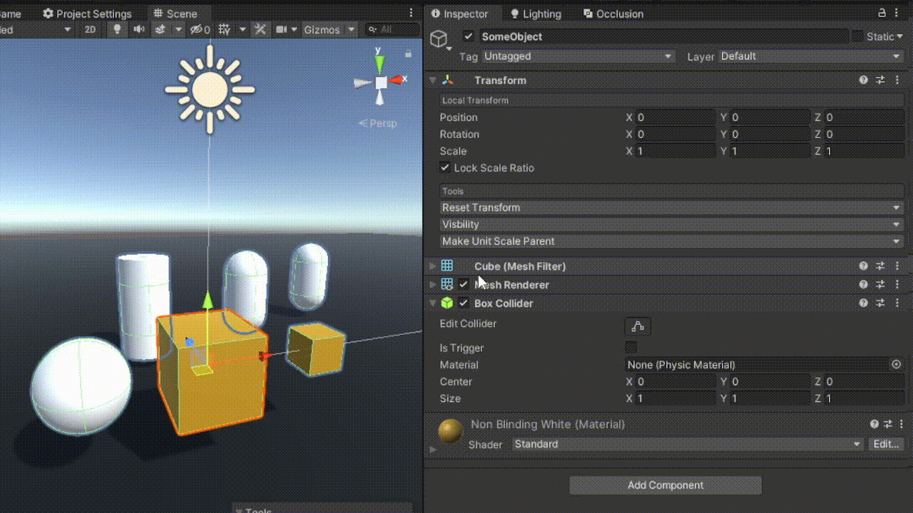

### 1.4 Make Unit Scale Parent:
For a lot of use-cases in Unity [wanting to have a unit scale or have positioning, rotation start from zero], we tend to create new objects and then assign it as a parent. This button does that.

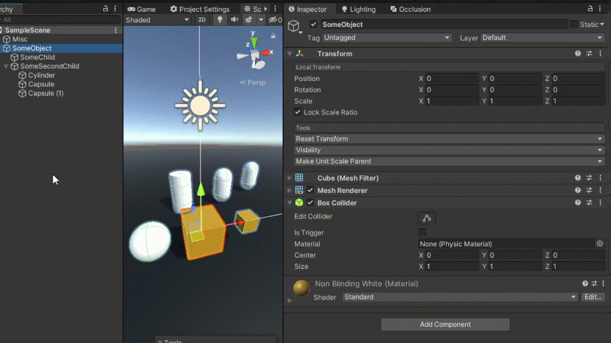

## 2. Inspector Additions

### 2.1 Better Rename
A lot of the times when developing, you have similar children which you want to be named incrementally with your desired prefix. Instead of manually going in and doing it, this module allows me to do more it quickly and effeciently, by attaching a script to the parent.

Further, when duplicating objects and creating new ones, Unity appends (x) [x being the current duplicate] and sometimes you would want the objects to be named differently. All new objects will also be renamed appropriately, automatically.


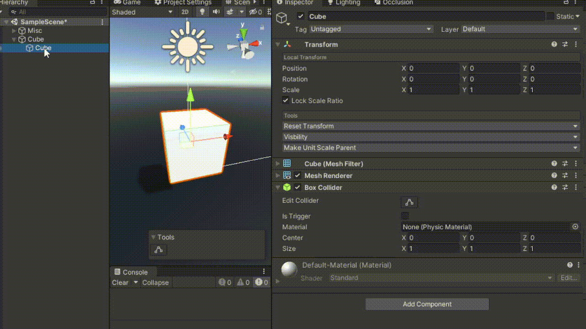

<br>

### 2.2 Inspector Button
You can expose normally variables and fields to the inspector in Unity and modify them in-realtime, and it works great. Sometimes, you would want to have a button set to easily call a function of your liking from the inspector and I tend to use workarounds (such as, setting a boolean and then calling a function after checking the boolean from Update) or creating your custom inspector and having a button there. This is a much more easier and simpler addition to your existing scripts and can be called using simple property attributes.

Usage:
```C#
[InspectorButton("funcToBeCalled")]
public char myButton;
```

The above snippet will create a button named My Button and will call <i>funcToBeCalled</i> function when pressed.


You can also specify the size of the button (default size is 80):
```C#
[InspectorButton("funcToBeCalled",100)]
public char myButton;
```

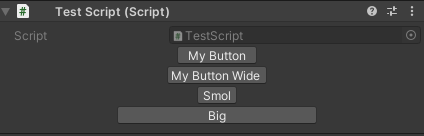

<br>

### 2.3 Better Scale
A script which works similar to the BetterTransform component but given incase you dont wish to override default transform and just want the uniform scaling on one object.

<br>

## 3. Debug Tools

### 3.1 Debug Log to Screen:
Unity has a great Debug system but lacks in outputting it while full-screened/inside VR and hence this is an Unreal-Inpsired simple way to display all Debug Log messages on the screen. All messages fade away after a while and also start replacing old logs if too many are outputted quickly.


<br>

### 3.2 Simple FPS Counter
A very simple skeletal frames-per-second counter. Inverses unscaled delta time to output fps on the screen.

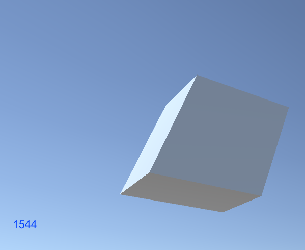

<br>

## 4. Helpers
A collection of extension functions which can be called in other scripts for ease-of-use.

### 4.1 Scale Range
Scale a value from a previous range to a new range (remap it linearly).

```C#
myFloatValue.ScaleRange(0,100,10,30);
```

### 4.2 Destory Children
Destroy all children of a parent.

```C#
transform.DestroyChildren();
```

### 4.3 Minus Float Vector 3
Subtract one float value from x, y, z components of a Vector3.

```C#
myVector3.MinusFloatVector3(2.5f);
```

### 4.4 LookAtY
Look at but rotate only across the Y axis (say, for an enemy that needs to turn to you at all times).

```C#
transform.LookAtY(player.position);
```

### 4.5 Grounded/Distance From Ground
Returns distance between two vectors but its grounded. (ignoring their Y-position during calculation)
```C#
player.position.DistanceFromGround(objective.position);
```

### 4.6 Return a random item from a list
Get a random item from a list
```C#
currentItem = myList.RandomItem();
```

## 5. VR Scripts
Useful scripts that aid in my VR development.

### 5.1 Head Level
Make an object always align with our headset's level.


## 6. Toolbar Tools

Tools to do various functions, called by menus.

### 6.1 Rename Suite
Works similar to BetterRename except its for remaining them only once. [We can attach the script, do the rename, and then remove it if we would want but this has a much cleaner UX]. Further, it allows you to rename any random [from anywhere to anywhere] selection at any place in the heirarchy.

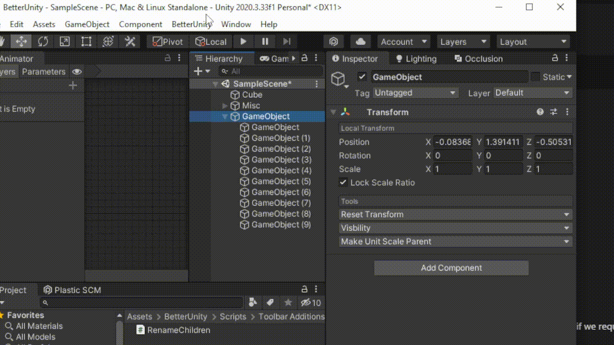

### 6.2 Setup Default Project
A one click button that set-ups directories in our project folder in a standardish way.

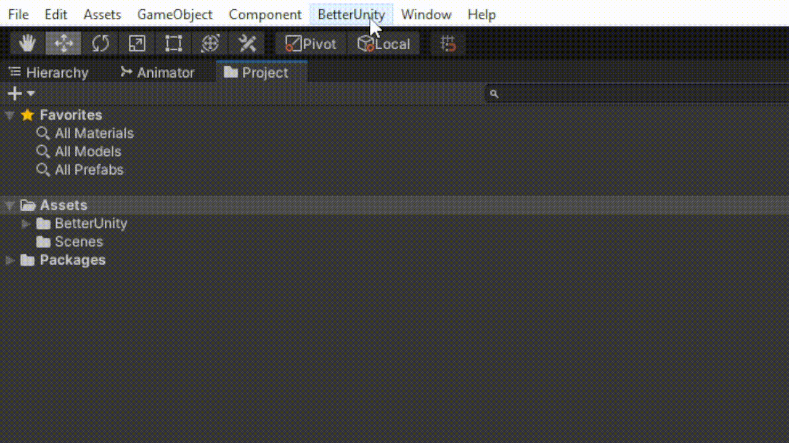

## 7. BetterContext
A collection of additions to various context menus throughout Unity.

### 7.1 Solve Import
Right click on any GameObject in the heirarchy to "Resolve Import Issues". A lot of times when importing 3D models, we tend to get empty objects, cameras, lights etc [usually dependent on the way the modeller exports them] and hence this button gets rid of them in one-go.

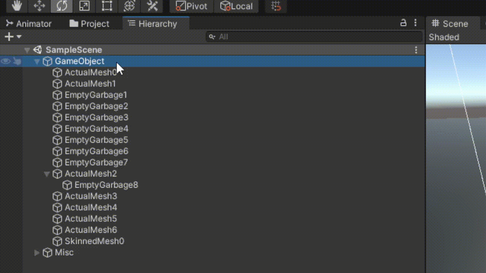

### 7.2 Other Contexts
- Rigidbody: I find myself wanting to freeze X, Z rotation and turn interpolation on and also make sure it's not kinematic. Right click and pressing this button does it all for me.

- AudioSource: One key feature missing from inspecting an AudioSource is the ability to play, pause and stop it at will. Right click and pressing this does the aforementioned.

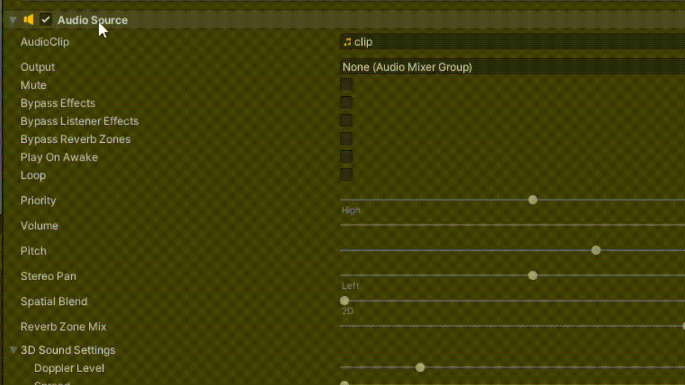


## 8. Miscellaneous

### 8.1 Controllers
Various basic controller templates, such as FPS, VR.

<br>

# Contribution
Generate a pull request for whatever change you feel is necessary and I will be happy to review and add them.

### Current to-do:
- Add more controllers templates.
- Add more VR utiltiy scripts.
- Update RenameSuite's gif
- Store GIFs on the cloud

